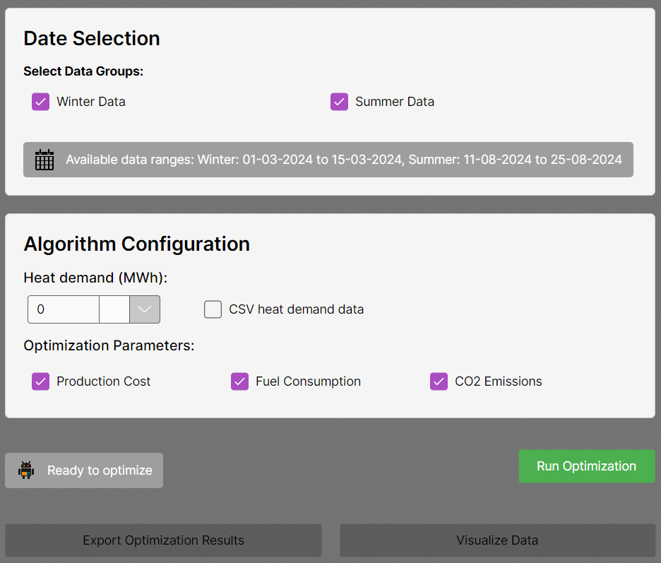
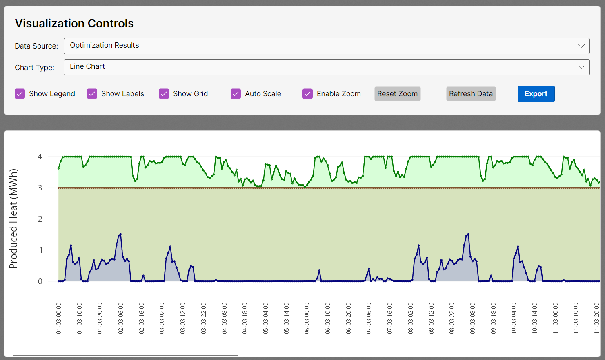

<div align="center">

# HPO Analyzer

**Heat Production Optimization — desktop tool built in collaboration with Danfoss**


[](https://github.com/DavidSerret/HPO/releases)

</div>

---





---

## Overview

HPO Analyzer is a desktop application that optimizes the operation of industrial heat production units to maximize profitability while maintaining reliable supply — developed as a semester project in collaboration with **Danfoss**.

The tool processes real operational data (heat demand, electricity prices, production unit specs) and runs a multi-parameter optimization algorithm across configurable time periods. Results are visualized with interactive charts and can be exported for reporting.

## Modules

| Module | Description |
|--------|-------------|
| **Asset Manager** | Create and configure production units (boilers, motors, heat pumps). Fully scalable — supports any assets the user defines. |
| **Source Data Manager** | Import heat demand and electricity price data (CSV or manual input) for winter and summer periods |
| **Optimizer** | Multi-parameter algorithm optimizing for production cost, CO₂ emissions, and fuel consumption simultaneously |
| **Result Data Manager** | Store, compare and export optimization results across scenarios |
| **Data Visualization** | Interactive line/area charts with zoom, auto-scale, and export |

## Optimization Scenarios

**Scenario 1** — 2 gas boilers + 1 oil boiler. Gas boilers are cost-primary; oil boiler activates at peak demand.

**Scenario 2** — 1 gas boiler + 1 oil boiler + 1 gas motor + 1 heat pump. Scheduling adapts dynamically to electricity prices: gas motor runs when prices are high, heat pump when prices are low.

Both scenarios split the year into **winter** (high demand, full unit scheduling) and **summer** (low demand, cost minimization focus).

## Stack

| Layer | Technology |
|-------|-----------|
| Language | C# |
| Framework | .NET |
| UI | AvaloniaUI |
| Data input | CSV + manual entry |
| Collaboration | Danfoss (real operational data) |

## Run

**Option 1 — Release binary**

Download the latest release from the [Releases](https://github.com/DavidSerret/HPO/releases) page and run the `.exe` directly.

**Option 2 — Build from source**

```bash
git clone https://github.com/DavidSerret/HPO.git
cd HPO
dotnet restore
dotnet build
dotnet run
```

Requires .NET 8+ and Visual Studio or VS Code with the C# extension.

---

<div align="center">
  SDU Software Engineering · Semester 2 · Danfoss collaboration<br>
  <a href="https://github.com/DavidSerret/HPO/releases">Download ↓</a> · <a href="https://github.com/DavidSerret">@DavidSerret</a>
</div>
